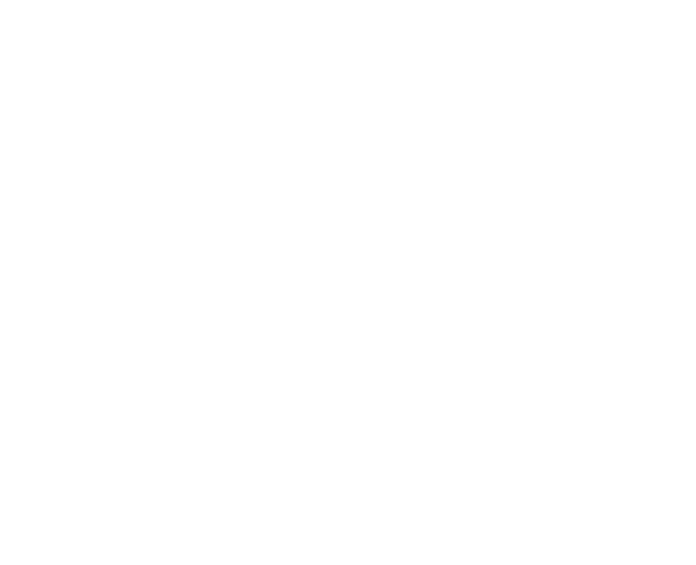

<!--
*** Thanks for checking out the Best-README-Template. If you have a suggestion
*** that would make this better, please fork the repo and create a pull request
*** or simply open an issue with the tag "enhancement".
*** Don't forget to give the project a star!
*** Thanks again! Now go create something AMAZING! :D
-->

<!-- PROJECT SHIELDS -->
<!--
*** I'm using markdown "reference style" links for readability.
*** Reference links are enclosed in brackets [ ] instead of parentheses ( ).
*** See the bottom of this document for the declaration of the reference variables
*** for contributors-url, forks-url, etc. This is an optional, concise syntax you may use.
*** https://www.markdownguide.org/basic-syntax/#reference-style-links
-->
[![LinkedIn][linkedin-shield]][linkedin-url]

<!-- PROJECT LOGO -->

  <h3 align="center">HoboTracks</h3>

  

    Create a personal journal of your trip, follow other travel's journeys, and see what messages they left behind all over the globe.
     
    <a href=https://hobotracks.herokuapp.com/"><strong>View Demo »</strong></a>
  

<!-- TABLE OF CONTENTS -->

  
Table of Contents

  <ol>
    <li>
      <a href="#about-the-project">About The Project</a>
      <ul>
        <li><a href="#built-with">Built With</a></li>
      </ul>
    </li>
    <li><a href="#roadmap">Future Updates</a></li>
    <li><a href="#contact">Contact</a></li>
    <li><a href="#acknowledgments">Acknowledgments</a></li>
  </ol>

<!-- ABOUT THE PROJECT -->
## About The Project

[![HoboTracks Screen Shot][product-screenshot]](https://hobotracks.herokuapp.com/)

Inspired from the explorers and adventures of the past, HoboTracks takes inspiration from the "Hobo Code" used in the early 20th century train hoppers. HoboTracks allows you to create a personal journal of your trip, follow other travel's journeys, and see what messages they left behind all over the globe.

HoboTracks Features:
* Ability to create personal travel journal
* Include "stops" in your journal which correspond to markers added to a Google Map
* Upload travel pictures to your journal
* Search for trips that other users added
* Use the Explore page to view all stop markers added by users and the ability visit their personal journal
* Follow other users
* View most recent activity of people you follow
* Add trips to a personal "favorites" list

(<a href="#top">back to top</a>)

## Built With

### Front End

* [React.js](https://reactjs.org/)
* [React Maps API](https://github.com/JustFly1984/react-google-maps-api)
* [Tailwind CSS](https://tailwindcss.com/)
* [React Router](https://reactrouter.com/)

### Back End

* [Ruby on Rails](https://rubyonrails.org/)
* [PostgreSQL](https://www.postgresql.org/)
* [Bcrypt-Ruby](https://github.com/bcrypt-ruby/bcrypt-ruby)
* [Active Storage](https://edgeguides.rubyonrails.org/active_storage_overview.html)
* [AWS S3](https://aws.amazon.com/s3/)

(<a href="#top">back to top</a>)

<!-- FUTURE UPDATES -->
## Future Updates

- [ ] Mobile Optimization
- [ ] Better Optimized API Calls
- [ ] Integrate Redux to allow for less complex state management
- [ ] Add Route setting capabilities
- [ ] More Search Filters/Capabilities

(<a href="#top">back to top</a>)

<!-- CONTACT -->
## Contact

Evan Chernicky
* [Personal Website](https://evanchernicky.com/)
* [LinkedIn](https://www.linkedin.com/in/echernicky/)
* [Medium](https://medium.com/@echernicky)
* [Email](echernicky@gmail.com)

Project Link: [https://hobotracks.herokuapp.com/](https://hobotracks.herokuapp.com/)

(<a href="#top">back to top</a>)

<!-- ACKNOWLEDGMENTS -->
## Acknowledgments

* [Ruby on Rails #21 Active Storage With Amazon S3 Cloud Storage](https://www.youtube.com/watch?v=OWBWXOcx1rU&t)
* [Animista](https://animista.net/)

(<a href="#top">back to top</a>)

<!-- MARKDOWN LINKS & IMAGES -->
<!-- https://www.markdownguide.org/basic-syntax/#reference-style-links -->
[linkedin-url]: https://www.linkedin.com/in/echernicky/
[product-screenshot]: images/Trip-View.png
[linkedin-shield]: https://img.shields.io/badge/-LinkedIn-black.svg?style=for-the-badge&logo=linkedin&colorB=555
